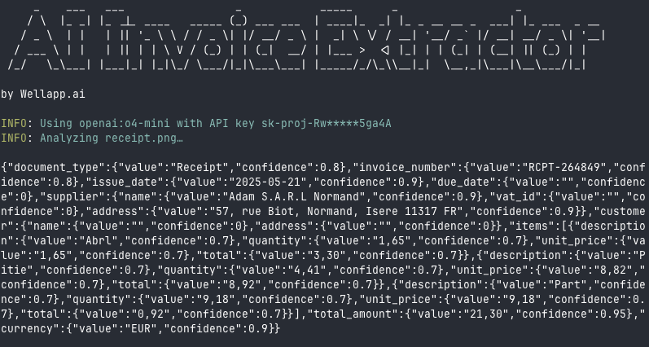

<a href="https://wellapp.ai/">
    
</a>

<div align="center">
    
    
    
</a>
</div>
<br />
<div align="center"><strong>Extract Receipt & Invoice Data</strong></div>
<div align="center"> Lightweight, customizable and open source.</div>
<br />
<div align="center">
<a href="https://">Website</a> 
<span> · </span>
<a href="https://">X</a>
</div>

<br />

## Features

- 🔍 Extract invoice/receipt data
- 🧠 Choose your AI models (OpenAI, Mistral, Google Gemini, and Ollama)
- 🔧 Set AI keys with CLI and environment variables
- ⭐ Pretty print the output
- 🔄 Pipe output with other CLI

## Usage

Quick start:

```sh
npx ai-invoice-extractor -k [openai-api-key] examples/receipt.png
```

<div align="left">
    
</div>

## Docs

Get help with `-h`:

```sh
npx ai-invoice-extractor -h 
Usage: ai-invoice-extractor [options] <file-path>

AI-based image/PDF invoices/receipts data extractor.

Arguments:
  file-path              Invoice/receipt file path (image or PDF)

Options:
  -v, --vendor [vendor]  AI vendor
  -m, --model [model]    AI model
  -k, --key [key]        AI key
  -p, --pretty           Output pretty JSON (default: false)
  -h, --help             display help for command
```

Use also environment variables instead of `-v`, `-m` and `-k`:
```sh
# EXTRACTOR_VENDOR="openai" # openai (default) | mistral | google | ollama
# EXTRACTOR_MODEL="o4-mini" # o4-mini (default with openai)
EXTRACTOR_API_KEY=
```

CLI options take precedence over environment variables. For instance, if 'openai' is configured as an environment variable, but you specify 'mistral' through the CLI, the final AI vendor will be determined as 'mistral'.

## Copyright

&copy; [WellApp][wellapp] - Under [MIT license][license].

[wellapp]: https://wellapp.ai/
[license]: ./LICENSE